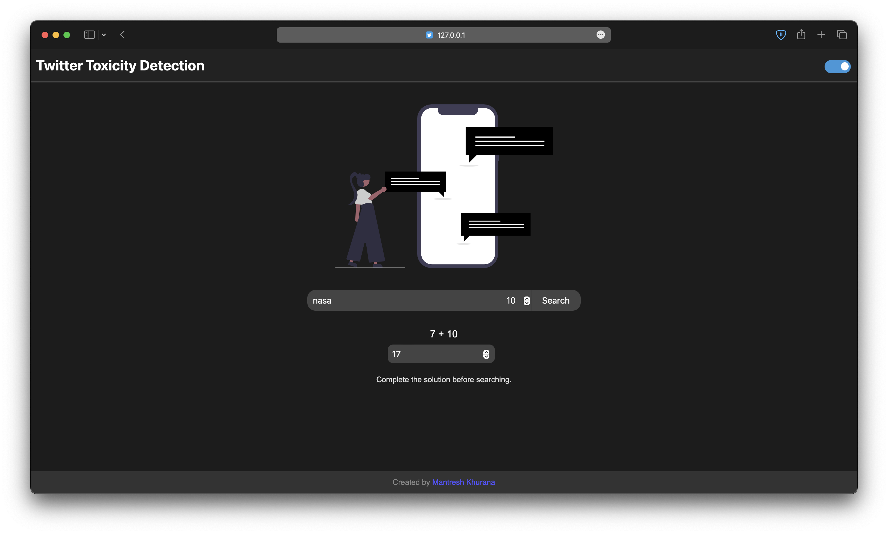
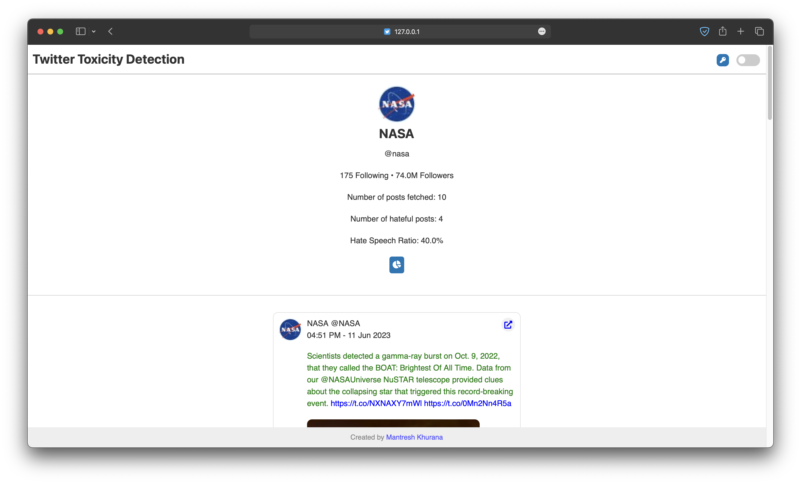
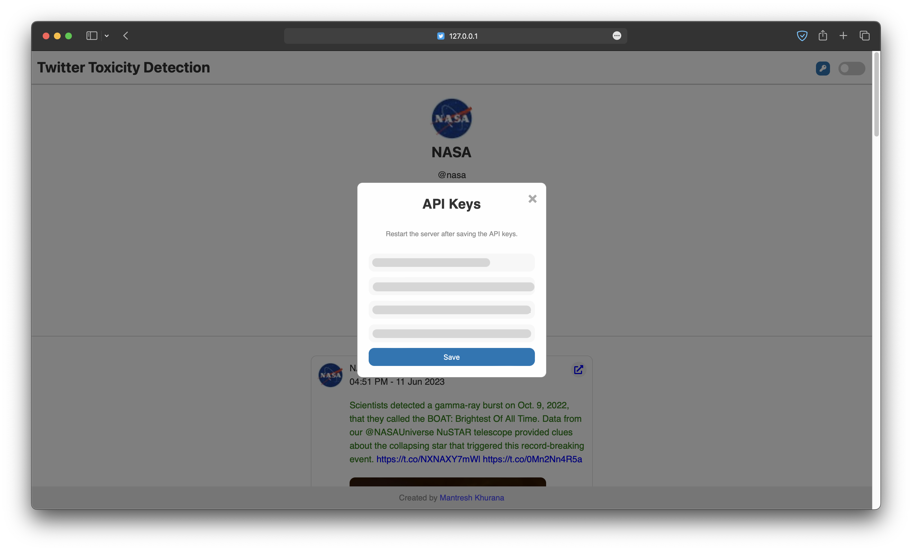
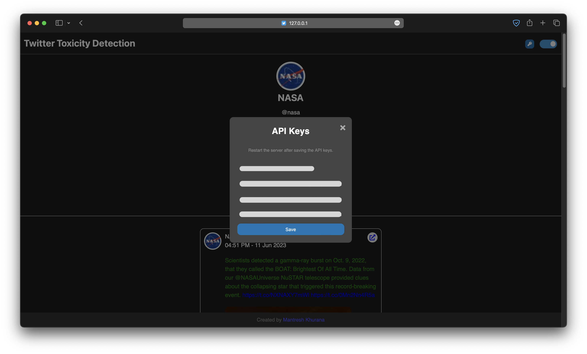

# Twitter Toxicity Detection Flask

This is a Flask web application that allows users to search for a Twitter user's recent tweets and get a toxicity score for each tweet using a pre-trained logistic regression model.

It has a [Window GUI](#window-gui) version which can also be used to do the same without opening the browser.

## Tabel of Contents

- [Twitter Toxicity Detection Flask](#twitter-toxicity-detection-flask)
  - [Demo](#demo)
    - [Demo Video](#demo-video)
    - [Screenshots](#screenshots)
    - [Pie Chart](#pie-chart)
    - [Window GUI](#window-gui)
  - [Installation](#installation)
    - [Virtual Environment](#virtual-environment)
    - [Locally](#locally)
  - [Usage](#usage)
  - [Features](#features)
  - [Project Structure](#project-structure)
  - [Contributing](#contributing)
  - [Author](#author)

## Demo

### Demo Video

https://github.com/mantreshkhurana/twitter-toxicity-detection-flask/assets/120998049/dba98bad-50d3-472c-bd22-e4cfe4282425

### Screenshots

| Light | Dark |
| :---: | :---: |
|  | 
|  | 

### Pie Chart

You can see a pie chart which portrays the percentage of tweets that are toxic and non-toxic. It can be viewed by clicking on the view Pie Chart button which is located bellow `following` and `followers` count

<a align="left">
  
</a>

## API Keys Popup

After saving the API keys, you can close the popup and restart the flask server.

| Light | Dark |
| :---: | :---: |
|  | 

### Window GUI


## Installation

You may need to install some dependencies before running the program(some of the modules cannot be installed directly by using `requirements.txt`).

Get Twitter API keys from [here](https://developer.twitter.com/en/docs/twitter-api/getting-started/getting-access-to-the-twitter-api).

> **Note**: Make sure to apply for Twitter Elevated Access to use the Twitter API v2 endpoints, without elevated access you will not be able to use this app. (It's FREE until you reach the limit of 2,000,000 tweets per month)

To get started with this project, follow these steps:

### Virtual Environment

I recommend using a virtual environment for this project.

```bash
git clone https://github.com/mantreshkhurana/twitter-toxicity-detection-flask.git
cd twitter-toxicity-detection-flask
python -m venv venv
source venv/bin/activate
pip install -r requirements.txt
touch .env
echo "CONSUMER_KEY=<your_twitter_api_consumer_key>" >> .env # replace <your_twitter_api_consumer_key> with your Twitter API consumer key
echo "CONSUMER_SECRET=<your_twitter_api_consumer_secret>" >> .env # replace <your_twitter_api_consumer_secret> with your Twitter API consumer secret
echo "ACCESS_TOKEN=<your_twitter_api_access_token>" >> .env # replace <your_twitter_api_access_token> with your Twitter API access token
echo "ACCESS_TOKEN_SECRET=<your_twitter_api_access_token_secret>" >> .env # replace <your_twitter_api_access_token_secret> with your Twitter API access 
python app.py
```

### Locally

```bash
git clone https://github.com/mantreshkhurana/twitter-toxicity-detection-flask.git
cd twitter-toxicity-detection-flask
pip install -r requirements.txt
touch .env
echo "CONSUMER_KEY=<your_twitter_api_consumer_key>" >> .env # replace <your_twitter_api_consumer_key> with your Twitter API consumer key
echo "CONSUMER_SECRET=<your_twitter_api_consumer_secret>" >> .env # replace <your_twitter_api_consumer_secret> with your Twitter API consumer secret
echo "ACCESS_TOKEN=<your_twitter_api_access_token>" >> .env # replace <your_twitter_api_access_token> with your Twitter API access token
echo "ACCESS_TOKEN_SECRET=<your_twitter_api_access_token_secret>" >> .env # replace <your_twitter_api_access_token_secret> with your Twitter API access token secret
python app.py
```

or

```bash
git clone https://github.com/mantreshkhurana/twitter-toxicity-detection-flask.git
cd twitter-toxicity-detection-flask
pip3 install -r requirements.txt
touch .env
echo "CONSUMER_KEY=<your_twitter_api_consumer_key>" >> .env # replace <your_twitter_api_consumer_key> with your Twitter API consumer key
echo "CONSUMER_SECRET=<your_twitter_api_consumer_secret>" >> .env # replace <your_twitter_api_consumer_secret> with your Twitter API consumer secret
echo "ACCESS_TOKEN=<your_twitter_api_access_token>" >> .env # replace <your_twitter_api_access_token> with your Twitter API access token
echo "ACCESS_TOKEN_SECRET=<your_twitter_api_access_token_secret>" >> .env # replace <your_twitter_api_access_token_secret> with your Twitter API access token secret
python3 app.py
```

Navigate to [http://127.0.0.1:5000/](http://127.0.0.1:5000/) in your web browser to use the app, else `flask run -p 8000`.

## Usage

```bash
python app.py
```

If you want to run the app in a Window GUI:

```bash
python app.py --window
# or
python app.py -w
```

Use custom port:

```bash
python app.py --port 8000
# or
python app.py -p 8000
```

## Features

- [x] Search for a Twitter user's recent tweets.
- [x] Dark/Light mode.
- [x] View a pie chart for profile's toxicity.
- [x] View user's profile picture, name, username, bio, location, website, following, followers, and tweet count*.
- [x] View images/videos in tweets.
- [x] View retweets and likes count for each tweet.
- [x] View the date and time of each tweet.
- [x] View the source of each tweet.
- [x] Twitter like feed.
- [x] Simple bot protection.
- [x] GUI Window Added.
- [x] Dialog to store API Keys in `.env`.
- [ ] Images/Videos toxicity detection.

## Project Structure

```txt
twitter-toxicity-detection-flask/
├── app.py
├── models/
│   └── hate_speech_model.csv
├── static/
│   ├── css/
│   │   └── style.css
│   └── js/
│       └── script.js
├── templates/
│   ├── index.html
│   ├── results.html
│   └── error.html
├── .env
├── .gitignore
├── README.md
└── requirements.txt
```

## Contributing

Since this project took <12 hours to make you may find some bugs or you may want to add some features to it. You can contribute to this project by forking it and making a pull request(I am quite active on Github so if any issue arises I will try to fix it as soon as possible).

After forking:

```bash
git clone https://github.com/<your-username>/twitter-toxicity-detection-flask.git
cd twitter-toxicity-detection-flask
git checkout -b <your-branch-name>
# after adding your changes
git add .
git commit -m "your commit message"
git push origin <your-branch-name>
```

## Credits

- [Flask](https://www.fullstackpython.com/flask.html)
- [Twitter](https://twitter.com/)
- [Sklearn](https://scikit-learn.org/stable/)
- [Python](https://www.python.org/)
- [Tweepy](https://www.tweepy.org/)
- [pywebview](https://pywebview.flowrl.com/)

## Author

- [Mantresh Khurana](https://github.com/mantreshkhurana)
