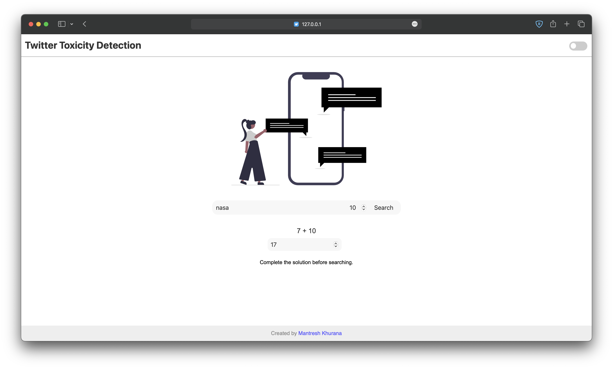

# Twitter Toxicity Detection Flask

This is a Flask web application that allows users to search for a Twitter user's recent tweets and get a toxicity score for each tweet using a pre-trained logistic regression model.

## Tabel of Contents

- [Twitter Toxicity Detection Flask](#twitter-toxicity-detection-flask)
  - [Screenshots](#screenshots)
  - [Installation](#installation)
  - [Project Structure](#project-structure)
  - [Contributing](#contributing)
  - [Author](#author)

## Demo

### Demo Video

https://raw.githubusercontent.com/mantreshkhurana/twitter-toxicity-detection-flask/stable/assets/videos/demo.mp4

### Screenshots

| Light | Dark |
| :---: | :---: |
|  | 
|  | 

You can see a pie chart which portrays the percentage of tweets that are toxic and non-toxic. It can be viewed by clicking on the view Pie Chart button which is located bellow `following` and `followers` count.


## Installation

You may need to install some dependencies before running the program(some of the modules cannot be installed directly by using `requirements.txt`).

Get Twitter API keys from [here](https://developer.twitter.com/en/docs/twitter-api/getting-started/getting-access-to-the-twitter-api).
To get started with this project, follow these steps:

```bash
git clone https://github.com/mantreshkhurana/twitter-toxicity-detection-flask.git
cd twitter-toxicity-detection-flask
pip install -r requirements.txt
touch .env
echo "CONSUMER_KEY=<your_twitter_api_consumer_key>" >> .env # replace <your_twitter_api_consumer_key> with your Twitter API consumer key
echo "CONSUMER_SECRET=<your_twitter_api_consumer_secret>" >> .env # replace <your_twitter_api_consumer_secret> with your Twitter API consumer secret
echo "ACCESS_TOKEN=<your_twitter_api_access_token>" >> .env # replace <your_twitter_api_access_token> with your Twitter API access token
echo "ACCESS_TOKEN_SECRET=<your_twitter_api_access_token_secret>" >> .env # replace <your_twitter_api_access_token_secret> with your Twitter API access token secret
python app.py
```

or

```bash
git clone https://github.com/mantreshkhurana/twitter-toxicity-detection-flask.git
cd twitter-toxicity-detection-flask
pip3 install -r requirements.txt
touch .env
echo "CONSUMER_KEY=<your_twitter_api_consumer_key>" >> .env # replace <your_twitter_api_consumer_key> with your Twitter API consumer key
echo "CONSUMER_SECRET=<your_twitter_api_consumer_secret>" >> .env # replace <your_twitter_api_consumer_secret> with your Twitter API consumer secret
echo "ACCESS_TOKEN=<your_twitter_api_access_token>" >> .env # replace <your_twitter_api_access_token> with your Twitter API access token
echo "ACCESS_TOKEN_SECRET=<your_twitter_api_access_token_secret>" >> .env # replace <your_twitter_api_access_token_secret> with your Twitter API access token secret
python3 app.py
```

Navigate to [http://127.0.0.1:5000/](http://127.0.0.1:5000/) in your web browser to use the app, else `flask run -p 8000`.

## Project Structure

```txt
twitter-toxicity-detection-flask/
├── app.py
├── models/
│   ├── hate_speech_model.csv
├── static/
│   ├── css/
│   │   └── style.css
│   └── js/
│       └── script.js
├── templates/
│   ├── index.html
│   └── results.html
├── .env
├── .gitignore
├── README.md
└── requirements.txt
```

## Contributing

Since this project took <12 hours to make you may find some bugs or you may want to add some features to it. You can contribute to this project by forking it and making a pull request(I am quite active on Github so if any issue arises I will try to fix it as soon as possible).

After forking:

```bash
git clone https://github.com/<your-username>/twitter-toxicity-detection-flask.git
cd twitter-toxicity-detection-flask
git checkout -b <your-branch-name>
# After adding your changes
git add .
git commit -m "your commit message"
git push origin <your-branch-name>
```

## Credits

- [Flask](https://www.fullstackpython.com/flask.html)
- [Twitter](https://twitter.com/)
- [Sklearn](https://scikit-learn.org/stable/)
- [Python](https://www.python.org/)
- [Tweepy](https://www.tweepy.org/)

## Author

- [Mantresh Khurana](https://github.com/mantreshkhurana)
